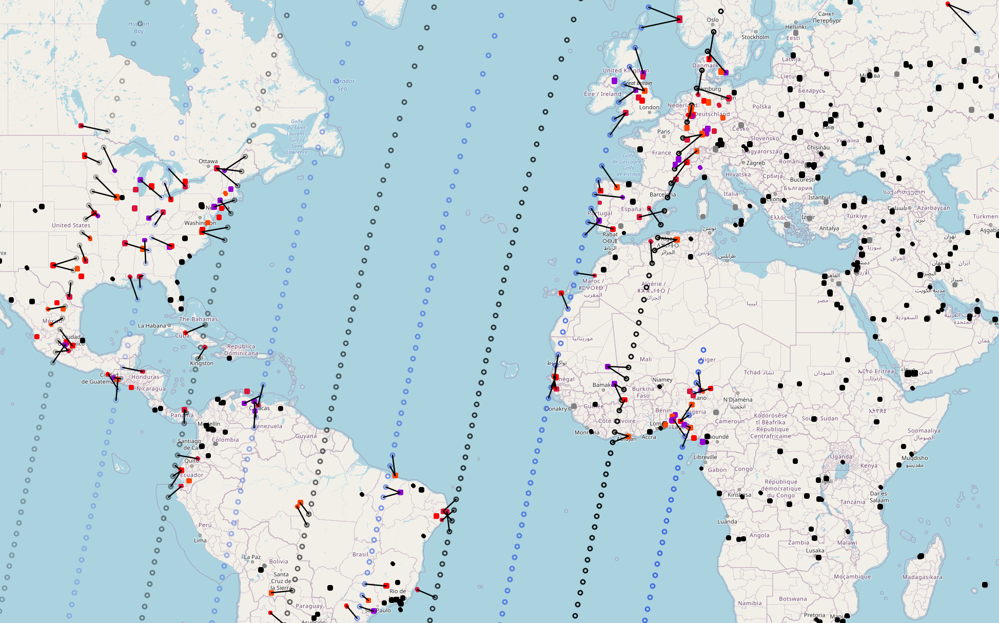
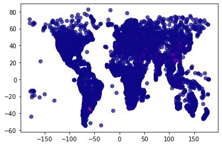
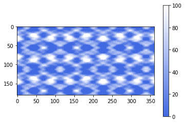
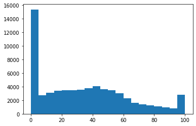

# EOSPython


The `EOSPython` package enables *scenario generation*, *pre-processing*, *problem setup*, *solution approach decision maker preference integration*, and *visualization*, in the context of Centralized Earth Observation Satellites.



The package supports DM preferences introduced by utilizing one of the following scoring approaches:
- [Modified ELECTRE-III](https://en.wikipedia.org/wiki/%C3%89LECTRE)
- [TOPSIS](https://en.wikipedia.org/wiki/TOPSIS)
- [WSA](MISSING LINK)

Note that all of the scoring methods utilizes the [Ordinal Priority Approach](https://en.wikipedia.org/wiki/Ordinal_priority_approach). Furthermore, the methods contain representative variables to elicited information as opposed to using pairwise evaluations.

The package support the following solution procedures:
 - GLPK: A large scale LPP solver from *cvxopt*.
 - ELPA: An extended longest path algorithm that can manage extremely large problem scenarios.
 - gurobi: A large scale LPP solver from *gurobi* (Requires an API key).
 - PuLP: A large scale LPP solver from *PuLP* (Requires an API key).
 - Random greedy approach: Can manage large scale problems, but performs very poorly, and is only really applicable to showcase complexity.

**Note:** Some problem scenarios are too large for the LPP solvers to manage. 

## Dependencies
The external package dependencies are:
- `numpy`, `pandas`, `requests`, `ephem`, `folium` (for a visual html map output), `scipy`, `tqdm`.

Additionally, the different solvers also comes with their own dependencies:
- `cvxopt` ([Free](https://pypi.org/project/cvxopt/))
- `gurobipy` ([Free/Paid](https://pypi.org/project/gurobipy/))
- `PuLP` ([Paid](https://pypi.org/project/PuLP/))
  - [How to configure a solver in PuLP](https://coin-or.github.io/pulp/guides/how_to_configure_solvers.html)
- `docplex` ([Paid](https://pypi.org/project/docplex/))

Real satellite paths are introduced through their *TLE* (Go to [https://celestrak.org](https://celestrak.org) to obtain TLEs. Default are Spot 6 and 7 with Pleiades A and B). Furthermore, there is an option to generate or obtain real-time, and historic, weather data (cloud coverage) when creating the scenario. This does however require an API key from [OpenWeatherMap](https://openweathermap.org/api) (Free/Paid). 


## Usage

### Install 
```python
pip install EOSpython
```

#### API Keys
Create .env file in your project folder. Add the following depending on which API you are trying to reach:
- OWM_API_KEY="YOUR_OPENWEATHERMAP_API_KEY"
- WB_API_KEY="YOUR_WEATHEBIT_API_KEY"
...

### Functionality
The four main functions are `EOSscenario()`, `EOSsolve()`, `EOSvisualize()`, and `EOSevaluate()` - These are further explored below.

#### `EOS.customer_db()`
Generates a customer "database" in the format of a pandas dataframe, as well as an HTML file; which allows the user to inspect the database. The "database" is used for further realization of the problem scenario when we match it with a set of satellites and their operational capabilities, as well as the actual planning horizon. The customer "database" consists of a set of columns that describe the image request properties for each individual request. 
The format is: 

|    | Column            | Non-Null Count | dtype   |
| -- | ----------------- | -------------- | ------- |
| 0  | ID                | 250            | object  |
| 1  | acquired          | 250            | int64   |
| 2  | reachable         | 250            | int64   |
| 3  | request location  | 250            | object  |
| 4  | day               | 250            | int64   |
| 5  | area              | 250            | float64 |
| 6  | stereo            | 250            | int64   |
| 7  | strips            | 250            | int64   |
| 8  | duration          | 250            | float64 |
| 9  | priority          | 250            | int64   |
| 10 | priority mod      | 250            | int64   |
| 11 | customer type mod | 250            | int64   |
| 12 | price             | 250            | int64   |
| 13 | waiting time      | 250            | int64   |

If the user wants to test their own setup their "database" has to use the same format.


#### `EOS.scenario()`
Generates the problem scenario, such that the object functions as a general pre-processing for the EOS system. 
It is seeded so problem scenarios can be replicated across different environments and therefore utilized for evaluating different solution approaches. Note, it is not optimized for speed yet, so it will run rather slow.

The function takes the following arguments: 
| Argument               | Default Value      | dtype | Description           |
| ---------------------- | ------------------ | ----- | --------------------- |
| *seconds_gran*         | `20`               | int   | The discretization level of the satellite path (discrete optimization problem). |
| *number_of_requests_0* | `1000`             | int   | Customer requests in database initially (there is an option to continuously add customers to mimic the effect of a real EOS production where new customers are entering and one over time still wants to ensure that requests doesn't violate an age threshold. The customers are generated based on location distribution which is higher around urbanized areas - This should mimic the actual customer database that EOS companies see or at least mimic the density of requests that optimization problems face.) | 
| *NORAD_ids*            | `[38755, 40053]`   | list  | The chosen satellite TLEs. |
| *weather_real*         | `False`            | bool  | Whether real cloud coverage data is utilized for the chosen time horizon. |
| *simplify*             | `False`            | bool  | Whether constraints are simplified based on the principle of inter-set constraints - IT IS ONLY VALID IF a LPP solution approach is used s.a. GLPK.|
| *schedule_start*       | `[2021,7,21,9,40]` | list  | Is time of initiation for the schedule horizon. A list of the date entities expressing [year, month, day, hour, minute]. |
| *hours_horizon*        | `8`                | int   | Duration of planning horizon in hours |
| *max_off_nadir_angle*  | `30`               | float | Degrees that satellite can maneuver (or is allowed to still acquire pictures). |
| *height_satellite*     | `694`              | float | Altitude of satellites (in km) - this is in next iteration updated to automatically be calculated. |
| *rotation_speed*       | `30/12`            | float | Degrees per second - per [eoPortal](https://directory.eoportal.org/web/eoportal/satellite-missions/s/spot-6-7). |
| *cam_resolution*       | `1`                | float | m<sup>2</sup> per pixel. |
| *capacity_limit*       | `1000000`          | int   | Mega byte. |
| *satellite_swath*      | `3600`             | float | Swath of satellite images. |
| *map_generation*       | `True`             | bool  | Whether a visualization should be generated. |

Note, the scenarios consist of requests with stereo and strip requirements, which is modeled by the constraints. 
For a request to be considered, we have defined certain thresholds, namely a maximum cloud coverage of 50 pct. 

The function returns the following:
| Output                |         | dtype | Description                          |
| --------------------- | ------- | - | ------------------------------------ |
| *multi_sat_data.LPP*  |         | ` ` | the Linear programming problem Ax<=b |
|                       | *.LHS*  | ` ` | A in the Ax<b. |
|                       | *.RHS*  | ` ` | b in the Ax<b. |
|                       | *.eLHS* | ` ` | A in the Ax=b. |
|                       | *.eRHS* | ` ` | b in the Ax=b. |
| *multi_sat_data.df*    |        | ` ` | The data frame containing all information for the entire problem scenario (for each attempt). |
| *multi_sat_data.pf_df* |        | ` ` | The performance data frame for the relevant (reachable) image attempts. |
| *multi_sat_data.m*     |        | ` ` | The *folium* map with relevant problem scenario information. |

Two maps will be saved in your working directory as .HTML for inspection; `all_requests.html` and `sat_path.html`. (THIS FEATURE SHOULD MIGHT BE DEPRECATED LATER)

#### `EOS.solve()` 
This function contains both the preference integration part (scoring) and the solution approach.

The function takes the following arguments:
| Argument               | Default Value                                                                  | dtype | Description                                               |
| ---------------------- | ------------------------------------------------------------------------------ | ----- | --------------------------------------------------------- |
| *scoring_method*       | `"TOPSIS"`                                                                     | str   | Can be "TOPSIS", "ELECTRE", "WSA" (Naive scoring method") |
| *solution_method*      | `""DAG""`                                                                      | str   | Can be "gurobi", "PuLP", "cplex", "VNS", "random", or "DAG". Note, for LPP approaches s.a. GLPK, the simplify argument in EOS.scenario() must be FALSE to not create for setwise acquisition constraints. That is, in the maneuvarability constraint to allow for the scenario where x1 cannot be acquired with x2 and x3, but x2 and x3 can be acquired together. |
| *criteria_weights*     | `[1,0,1,0,0,0,1,1,1]`                                                          | list  | Relevant for TOPSIS, ELECTRE, and WSA |
| *threshold_parameters* | `[[0,0,1000],[0,0,40],[0,0,40],[0,0,15],[0,0,4],[0,0,20000],[0,0,1], [0,0,1]]` | str   | Note, it is the indifference, preference, and veto threshold variables assigned for each criteria. |
| *alpha*                | `1`                                                                            | float | Is the factor with which scores are taken to the power of. It basically represent the level with which one trusts the computed score - it supplies the DM with ratio evaluation ability. Default value is 1 meaning this is neglected. |

The function returns the following:
| Output                    | dtype | Description |
| ------------------------- | - | ----------- |
| *multi_sat_testing.x*     | | The binary solution vector illustrating which attempts should be acquired and which should be neglected |
| *multi_sat_testing.score* | | The generated score for each attempt through the introduced preference setting. |
| *multi_sat_testing.time*  | | The runtime for the solution approach. |

Note, the order with which criteria are presented in the criteria weights and threshold_parameters arguments are:
1. Area, 
2. Angle, 
3. Sun Elevation, 
4. Cloud Cover, 
5. Priority, 
6. Price, 
7. Age, 
8. Uncertainty


#### `EOS.visualize()`
This funciton generates an HTML file in the designated folder containing a `folium` map of the problem instance and the solution obtained.

The function takes the following arguments: 
| Argument       | Default Value      | dtype | Description |
| -------------- | ------------- | ----- | ---------------- |
| *x_data*       | ` `           | int   | The resulting output from the `multi_sat_data()` function. |
| *x_res*        | ` `           | list  | The resulting output from the `multi_sat_testing()` function. |
| *name_of_html* | `"EOSpython"` | str   | A string for the name of the HTML file. The Output is a saved in the working folder.  |

Note, the visualize builds on the map, which is build in the scenario generation function `multi_sat_data()`.  It is not possible to either build a deep copy of the HTML file or sequentially add feature groups in the `folium` package and it is therefore not possible to sequentially run multiple different solution schemes without the former computed solution still being visible in the map - The capability of changing the color on the acquisition in `multi_sat_testing()` is therefore added. Note, this is hopefully being improved for next update.

#### `EOS.evaluate()`
This function provides a quick deeper evaluation functionality (than the total score and number of acquisitions provided in the sat_testing() function). The metrics showcased are:
| Scenario Specific Metrics   | Solution Specific Metrics                    |
| --------------------------- | -------------------------------------------- |
| Attempts                    | Acquisitions                                 |
| Unique Requests             | Profit                                       |
| Constraints in the LPP      | Cloud Coverage (Average)                     |
| Angle on attempts (Average) | Acquisitions with Good Cloud Cover (<10)     |
| Price (Average)             | Acquisitions with Bad Cloud Cover (>30)      |
| Sun elevation (Average)     | Depointing Angle (Average)                   |
| Cloud cover (Average)       | Acquisitions with Good Off-Nadir Angle (<10) |
| Priority (Average)          | Acquisitions with Bad Off-Nadir Angle (>30)  |
|                             | Priority 1 Acquisitions                      |
|                             | Priority 2 Acquisitions                      |
|                             | Priority 3 Acquisitions                      |
|                             | Priority 4 Acquisitions                      |
|                             | Sun Elevation (Average)                      |
|                             | Area Captured                                |

These can be accessed through the `evaluate.scenario` and `evaluate.solution` output. Note, that the average is often a bad metric, as a few very bad performing acquisitions can hide behind a larger set of requests. A better metric is therefore to look at quantiles or certain benchmarks and how many acquisitions with that profile was able to be captured.


### Example(s)
```python
from EOSpython import EOS
import pandas as pd                        # The evaluation output is presented as a pd dataframe
import numpy as np                         # The preference structure is given in numpy arrays

sat_TLEs = [38755, 40053] # Spot 6 and 7 - Assumed to be heterogenous an capable of acquiring the customer requests in the database

horizon_start = [2024,7,11,9,40] #Start time for planning window [year, month, date, hour, minute]

horizon = 8 # Planning horizon in hours

## Preference structure ##

# Corresponding weights related to the selection/scoring of image attempts
              #w
criteria_w =  [0.05,      # Area
               0.1,       # Off-nadir angle
               0.1,       # Sun elevation
               0.2,       # Cloud coverage 
               0.2,       # Priority
               0.1,       # Price
               0.2,       # Age
               0.05]      # Uncertainty

# If outranking model is used, then threshold variables q (indifference), p (preference), and v (veto)
       #q,  p,   v
qpv = [[0,  30,  1000],        # Area
       [0,  2,   40],          # Off-nadir angle
       [0,  10,  40],          # Sun elevation
       [0,  2,   15],          # Cloud coverage 
       [0,  1,   4],           # Priority
       [0,  100, 20000],       # Price
       [0,  4,   10],          # Age
       [0,  0.5,   1]]         # Uncertainty
```

#### Extended Longest Path Algoorithm and ELECTRE-III scoring approach
```python
# Create customer database
database, map_file = EOS.customer_db(number_of_requests_0 = 250)

print(database)
print(database.info())
# Note, if map_generation is True, the database can be inspected via the interactive all_requests.html file saved in the wd!


# Create scenario
x_data = EOS.scenario(customer_database = database, m = map_file, 
                      seconds_gran=10, 
                      NORAD_ids=sat_TLEs, #the 
                      weather_real = False, #we can by the use of an API key get real world cloud forecasts from the OWM platform
                      simplify = True) #we can simplify the set of constraints when using the ELPA algorithm
# One can also add their own customer database - the structure just have to be the same.
# The internal map generation function of the scenario module adds the satellite paths and reachable requests for the considered planning horizon.


# Generate a solution
x_res1 = EOS.solve(x_data, scoring_method=2, solution_method = "DAG", criteria_weights_l = criteria_w, threshold_parameters_l= qpv) #2=ELECTRE-III scoring approach
# Note, the solution method can be either: DAG, GLPK, gurobi, PuLP  - make sure to have the right capitulazation!

EOS.visualize(x_data, x_res1, 'EOS_example') #output is an interactive map called EOS_example.html saved in the wd

df = EOS.evaluate(x_data, x_res1)

print(df.solution)
print(df.scenario)

x_data = EOS.scenario(seconds_gran=10, number_of_requests_0=1000, 
                      NORAD_ids=sat_TLEs, weather_real = False, 
                      schedule_start = horizon_start, hours_horizon = horizon,
                      simplify = True) #we can simplify the set of constraints when using the ELPA algorithm
x_res1 = EOS.solve(x_data, scoring_method=2, solution_method = "DAG",   
                   criteria_weights = criteria_w, 
                   threshold_parameters= qpv)

EOS.visualize(x_data, x_res1, 'EOS_example') 

df1 = EOS.evaluate(x_data, x_res1)
print(df1.solution)
print(df1.scenario)
```

#### GLPK solver and the naive weighted sum scoring approach
```python
x_data = EOS.scenario(seconds_gran=10, number_of_requests_0=1000, 
                      NORAD_ids=sat_TLEs, weather_real = False, 
                      schedule_start = horizon_start, hours_horizon = horizon,
                      simplify = False) #for a non solver the simplify argument must be false, as solution space otherwise is overconstrained
x_res2 = EOS.solve(x_data, scoring_method=3, solution_method = "GLPK",  #3=WSA
                   criteria_weights = criteria_w, 
                   threshold_parameters= qpv)

EOS.visualize(x_data, x_res2, 'EOS_example') #output is an interactive map called EOS_example.html saved in the wd

df2 = EOS.evaluate(x_data, x_res2)
print(df2.solution)
print(df2.scenario)
```


## Improvements or Suggestions
**PLEASE let me know if you have any suggestions (good or bad) to the code - any comments are highly appreciated :-)** 

### General To-Do
- Add remaining docstring.
- The code contains a lot of constants. Make these variables and accessible through the API.
- Matrix generation might be slow in some scenarios. Vectorize these parts if possible.

In terms of added capabilities, I am currently considering:
 - There is a FutureWarning in a (NumPy?) dataframe function
 - IF there is no feasible requests it will just break down.. so this bug HAS to be fixed!
 - allowing integration of user specified customer database
 - integrate a larger plethora of solution approaches:
    - NSGA-II
    - NSGA-III
    - other greedy approaches?
 - added visualization traits
 - added evaluation metrics
 - allow usage of evaluation approaches outside of main functions, e.g. for usage in weight and threshold value elicitation
 - improve visualization to e.g. showcase operational criteria also (cloud cover, sun elevation)


## Appendix
In this section, some of the assumptions of the pre-processing is explained.
the distribution of the request database is mainly landbased requests, as these mimic the high and low concentration areas that can occur in an EOS setting, and in the scheduling we are (more or less) only interested in the high distribution areas - as of why the marine requests are omitted. The database is created based on the population density of the earth, and assumes therefore that EOS imagery requests mimic the same density map. See the below figure for one instance:



In the event that the OWM api keys (and the corresponding subscription to gain access to enough weather data acquitions) are not acquired, then the free option of generating cloud cover observations can be utilised in the weather_real=False argument of the multi_sat_data() functionality. This cloud cover generation generates cloud cover data based on a three level cos function. This is done due to the locality and temporal considerations that apply to the cloud cover of image requests. The output mimics some of the landbased cloud cover metrics that are presented on the NASA cloud report (https://earthobservatory.nasa.gov/images/85843/cloudy-earth), where e.g. 30 pct are close to cloud free observations and a third has to be disregarded due to more than 50 pct cloud coverge. The distribution can be seen below.



