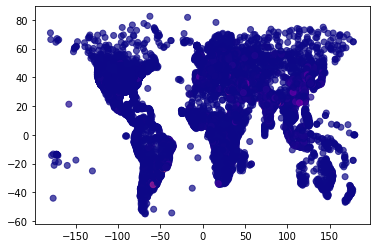

# EOSPython


The `EOSPython` package enables *scenario generation*, *pre-processing*, *problem setup*, *solution approach decision maker preference integration*, and *visualization*, in the context of Centralized Earth Observation Satellites.


The package supports DM preferences introduced by utilizing one of the following scoring approaches:
- [Modified ELECTRE-III](https://en.wikipedia.org/wiki/%C3%89LECTRE)
- [TOPSIS](https://en.wikipedia.org/wiki/TOPSIS)
- [WSA](MISSING LINK)

Note that all of the scoring methods utilizes the [Ordinal Priority Approach](https://en.wikipedia.org/wiki/Ordinal_priority_approach). Furthermore, the methods contain representative variables to elicited information as opposed to using pairwise evaluations.

The package support the following solution procedures:
 - GLPK: A large scale LPP solver from *cvxopt*.
 - ELPA: An extended longest path algorithm that can manage extremely large problem scenarios.
 - gurobi: A large scale LPP solver from *gurobi* (Requires an API key).
 - PuLP: A large scale LPP solver from *PuLP* (Requires an API key).
 - Random greedy approach: Can manage large scale problems, but performs very poorly, and is only really applicable to showcase complexity.

**Note:** Some problem scenarios are too large for the LPP solvers to manage. 

## Dependencies
The external package dependencies are:
- `numpy`, `pandas`, `requests`, `skyfield`, `scipy`, `tqdm`, and `folium` (for portable vizualisations).

Additionally, the different solvers also comes with their own dependencies:
- `cvxopt` ([Free](https://pypi.org/project/cvxopt/))
- `gurobipy` ([Free/Paid](https://pypi.org/project/gurobipy/))
- `PuLP` ([Paid](https://pypi.org/project/PuLP/))
  - [How to configure a solver in PuLP](https://coin-or.github.io/pulp/guides/how_to_configure_solvers.html)
- `docplex` ([Paid](https://pypi.org/project/docplex/))

Real satellite paths are introduced through their *TLE* (Go to [https://celestrak.org](https://celestrak.org) to obtain TLEs. Default are Spot 6 and 7 with Pleiades A and B). Furthermore, there is an option to generate or obtain real-time, and historic, weather data (cloud coverage) when creating the scenario. This does however require an API key from [OpenWeatherMap](https://openweathermap.org/api) (Free/Paid). This is however a WIP and is not yet implemented. 

## General To-Do
#### ADD
- [ ] Docstrings
- [ ] General Documentation
- [ ] NSGA-II solver
- [ ] NSGA-III solver
- [ ] More evaluation metrics
- [ ] Sun cover to visualization
- [ ] Sun elevation to visualization

#### FIX
- [ ] DAG solver
- [ ] RANDOM solver
- [ ] Evaluation function
- [ ] API integration with OpenWeatherMap
- [ ] API integration with WeatherBit
- [ ] No feasible yields exception


## Usage

### Install 
```python
pip install EOSpython
```

#### API Keys
Create .env file in your project folder. Add the following depending on which API you are trying to reach:
- OWM_API_KEY="YOUR_OPENWEATHERMAP_API_KEY"
- WB_API_KEY="YOUR_WEATHEBIT_API_KEY"
...

### Functionality
There exists three main functions: `scenario`, `solve()`, `evaluate`. These provide a high-level interface for simulating and solving the scheduling problem. Furthermore, these are comprised of several sub-functions.

#### `scenario`
Generates the problem scenario, such that the object functions as a general pre-processing for the EOS system. This function constructs the linear-programming problem from a database of requests. This database can be generated automatically, but can also be provided as an input.

The function takes the following arguments: 
| Argument                  | Default Value             | Type               | Description           |
| ----------------------    | ------------------        | -----              | --------------------- |
| *db*                      |                           | DataFrame          | Customer database. Will automatically generate on if none is provided to allow for testing. |
| *NORAD_ids*               |                           | List               | Satellite Catalog Numbers specifying which satellites to utilize. (https://en.wikipedia.org/wiki/Satellite_Catalog_Number) |
horizon_t0                  |                           | String             | When to start calculating the satellite paths. Must be `YYYY-MM-DD HH:MM:SS`. |
n_requests                  | `1000`                    | Integer            | The number of requests to generate. Only utilized when no customer database is provided. |
dt_acq                      | `20`                      | Integer            | Time between image attempts in seconds, i.e. discretization of the satellite path. |
horizon_dt                  | `8`                       | Integer            | Time to schedule into the future in hourse. Defaults to 8. |
ona_max                     | `30`                      | Float              | Maximum Off Nadir Angle in degrees, to ensure quality of image in degrees (https://www.euspaceimaging.com/what-is-ona-off-nadir-angle-in-satellite-imagery/). |
angular_velocity            | `2.5`                     | Float              | The agility of the satellite in degrees per second. |
cam_resolution              | `1`                       | Float              | Image resolution in m2 per pixel. |

Note, the scenarios consist of requests with stereo and strip requirements, which is modeled by the constraints. For a request to be considered, we have defined certain thresholds, namely a maximum cloud coverage of 50 pct. 

The "LPP" object, returned by the function, consists of the following:
| Key                | Type | Description                      |
| ----               | ---- | -------------------------------- |
| B                  |      | Repeated attempts constraints    |
| stereo             |      | Stereo constraints               |
| req_feasible       |      | Dataframe of feasible requests   |
| F                  |      | Rotational constraints           |
| LHS                |      | A in Ax<b                        |
| RHS                |      | b in Ax<b                        |
| eLHS               |      | A in Ax=b                        |
| eRHS               |      | b in Ax=b                        |

The following functions are representative of the `sceneario` call flow. 

##### `dataGenerator.genCustomerRequests`
Generates a customer "database" as a pandas dataframe. The "database" is used for further realization of the problem scenario when we match it with a set of satellites and their operational capabilities, as well as the actual planning horizon. The customer "database" consists of a set of columns that describe the image request properties for each individual request. 
The format is: 

| Index       | Column       | Type        | Description |
| ----------- | ------------ | ----------- | -- |
| 0           | id           | object      | ID as a string, eg. "001", if >100 requests have been generated. |
| 1           | wgs84        | object      | Position using WGS84 earth model. |
| 2           | area         | float64     | Area coverage. |
| 3           | stereo       | bool        | True if stereo image. |
| 4           | duration     | float64     | Completion time. |
| 5           | priority     | int64       | Numerical ranking from 1 (highest) to 4 (lowest). |
| 6           | price        | int64       | Cost of fulfillment. |
| 7           | age          | int64       | Days since submission. |
If the user wants to test their own setup their "database" has to use the same format.

##### `utility.utils.getFeasibleAngles`
Determines at which locations each satellite could possibly complete the request, based on the off-nadir angle.

##### `dataGenerator.genFeasibleRequests`
Uses the feasible angles and customer database to create a list of satellite requests pair which are feasible. Furthermore, it adds sun elevation and projected weather information to each request as well.

##### `utility.plotting.plotRequests` and `.plotSatPaths`
Plots the requests and satellite paths.

##### `LPP.createLPPFormulation`
Create the linear programming formulation, by creating the constraint matrices and realizing the global matrix of constraints. This function considers stereo pairs, max-attempts, maneuverability, image strips. Additionally, it augments the dataframe with feasible requests to accommodate the LPP stereo formulation, adding additional rows to represent the multiple requests. 


#### `solve` 
This function contains both the preference integration part (scoring) and the solution approach.

The function takes the following arguments:
| Argument           | Default Value      | Type    | Description                                               |
| -------------------| ------------------ | ------- | --------------------------------------------------------- |
| *scoring_method*   | `"TOPSIS"`         | String  | Can be "TOPSIS", "ELECTRE", "WSA" (Naive scoring method") |
| *solution_method*  | `""PuLP""`         | String  | Can be "gurobi", "PuLP", "cplex", "glpk", "VNS", "random", or "DAG". Note, for LPP approaches s.a. GLPK, the simplify argument in EOS.scenario() must be FALSE to not create for setwise acquisition constraints. That is, in the maneuvarability constraint to allow for the scenario where x1 cannot be acquired with x2 and x3, but x2 and x3 can be acquired together. |

The function returns the solution, as a boolean vector, and the corresponding scores. 

The following functions are representative of the `sceneario` call flow. 

##### `scoring.topsis` and `.electre_III`
The scoring method for the MCDM is selected. If ELECTRE III is selected, threshold criteria must also be provided as a kwarg. To learn more about each scorer, refer to the docstrings.

##### `solvers.solver_gurobi`, `solver_pulp`, `solver_cplex`, `solver_glpk`, `solver_dag`, `solver_vns`, and `solver_random`
The solution method for the MCDM is selected. Currently, the DAG and RANDOM solvers are broken. To learn more about each solver, refer to the docstrings. 

#### `evaluate`
**NOTICE: THIS MIGHT BE BROKEN AND IS NOT TESTED WITH THE LATEST REWORK!**

This function provides a quick deeper evaluation functionality (than the total score and number of acquisitions provided in the sat_testing() function). The metrics showcased are:
| Scenario Specific Metrics   | Solution Specific Metrics                    |
| --------------------------- | -------------------------------------------- |
| Attempts                    | Acquisitions                                 |
| Unique Requests             | Profit                                       |
| Constraints in the LPP      | Cloud Coverage (Average)                     |
| Angle on attempts (Average) | Acquisitions with Good Cloud Cover (<10)     |
| Price (Average)             | Acquisitions with Bad Cloud Cover (>30)      |
| Sun elevation (Average)     | Depointing Angle (Average)                   |
| Cloud cover (Average)       | Acquisitions with Good Off-Nadir Angle (<10) |
| Priority (Average)          | Acquisitions with Bad Off-Nadir Angle (>30)  |
|                             | Priority 1 Acquisitions                      |
|                             | Priority 2 Acquisitions                      |
|                             | Priority 3 Acquisitions                      |
|                             | Priority 4 Acquisitions                      |
|                             | Sun Elevation (Average)                      |
|                             | Area Captured                                |

These can be accessed through the `evaluate.scenario` and `evaluate.solution` output. Note, that the average is often a bad metric, as a few very bad performing acquisitions can hide behind a larger set of requests. A better metric is therefore to look at quantiles or certain benchmarks and how many acquisitions with that profile was able to be captured.


### Example(s)
```python
params = dict( # Scenario Parameters
       db=None, # Automatically generate a request database
       n_requests=1000, # Number of request in database
       NORAD_ids=[38755, 40053],  # Spot 6 and 7
       horizon_t0="2024-08-29 20:40:00", # Start time
       dt_acq=20, # Location discretization in seconds
       horizon_dt=8,  # Planning horizon in hours
       ona_max=30, # Maximum Off-Nadir Angle
       angular_velocity=30 / 12, # Satellite agility
       use_cloud_cover_data=False, # Generate cloud cover, don't use API calls
       plot_request_map=True, # Plot the request locations on the map
       plot_satellite_map=True, # Plot the satellite locations on the map
)
s = scenario(**params)
params = dict( # Solution Parameters
       scoring_method="TOPSIS",
       solution_method="PULP",
       criteria_thresholds=pd.DataFrame( # Threshold criteria for Electra scoring
       {
              "area": {"q": 0, "p": 50, "v": 1000},
              "angle": {"q": 2, "p": 5, "v": 40},
              "sun_elevation": {"q": 2, "p": 5, "v": 40},
              "cc_est": {"q": 0, "p": 5, "v": 15},
              "price": {"q": 0, "p": 1000, "v": 10000},
              "priority": {"q": 0, "p": 1, "v": 2},
              "age": {"q": 0, "p": 1, "v": 5},
              "uncertainty": {"q": 0, "p": 2, "v": 5},
       }
       ),
)
solution = solve(s["LPP"], **params)
plotSolutions(req_feasible=s["LPP"]["req_feasible"], schedules=solution["solution"], m=s["m"])
```

## Improvements or Suggestions
**PLEASE let me know if you have any suggestions (good or bad) to the code - any comments are highly appreciated :-)** 

## Appendix
In this section, some of the assumptions of the pre-processing is explained.
The distribution of the request database is mainly landbased requests, as these mimic the high and low concentration areas that can occur in an EOS setting, and in the scheduling we are (more or less) only interested in the high distribution areas - as of why the marine requests are omitted. The database is created based on the population density of the earth, and assumes therefore that EOS imagery requests mimic the same density map. See the below figure for one instance:



In the event that the OWM api keys (and the corresponding subscription to gain access to enough weather data acquitions) are not acquired, then the free option of generating cloud cover observations can be utilised in the weather_real=False argument of the multi_sat_data() functionality. This cloud cover generation generates cloud cover data based on a three level cos function. This is done due to the locality and temporal considerations that apply to the cloud cover of image requests. The output mimics some of the landbased cloud cover metrics that are presented on the NASA cloud report (https://earthobservatory.nasa.gov/images/85843/cloudy-earth), where e.g. 30 pct are close to cloud free observations and a third has to be disregarded due to more than 50 pct cloud coverge. The distribution can be seen below.


